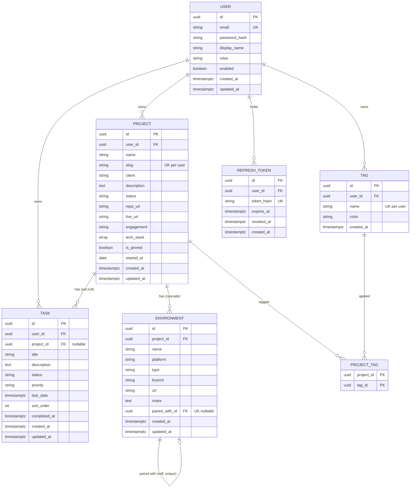

# Atlas — Product Requirements Document

**Version** 1.0 · **Author** Eric Mignardi · **Date** August 30, 2026
**Status** Approved for build · **Build window** August 31 – September 11, 2026

---

## Table of contents

1. [Problem statement](#1-problem-statement)
2. [Goals and non-goals](#2-goals-and-non-goals)
3. [User and journeys](#3-user-and-journeys)
4. [Functional requirements](#4-functional-requirements)
5. [Data model](#5-data-model)
6. [API contract](#6-api-contract)
7. [Validation rules](#7-validation-rules)
8. [Non-functional requirements](#8-non-functional-requirements)
9. [UI/UX specification](#9-uiux-specification)
10. [Acceptance criteria](#10-acceptance-criteria)
11. [Out of scope](#11-out-of-scope)

---

## 1. Problem statement

A solo developer running several projects at once loses track of **where things are deployed and
what each deployment is pointed at**. Not the code — the code is in Git and Git is fine. The
problem is the surrounding map:

- Which Vercel project serves `clientsite.com`, and is that the `main` branch or `production`?
- The preview deployment for the redesign — is it on the production database or a Neon branch?
- Which of these six environments is safe to run a destructive migration against?

That information lives in browser tabs, dashboards belonging to three different vendors, and
memory. It decays. Getting it wrong means running a migration against production.

General-purpose tools do not solve this:

| Tool | Why it does not fit |
|---|---|
| Notion / Obsidian | Free-form. Nothing enforces that an environment has a branch, or that a preview app is paired with a database. Rots immediately. |
| Jira / Linear | Built for teams and tickets. Enormous ceremony for one person, and no concept of an environment at all. |
| Trello | A task board and nothing else. |
| Vercel + Neon dashboards | Authoritative per-vendor, but there is no cross-vendor view, and no way to record *this app talks to that database*. |

**Atlas is a personal developer portal whose centrepiece is the environment map**: for every
project, every environment, on every platform, with each application environment explicitly
**paired** to the database environment it points at. Tasks, tags, and a dashboard wrap around
that spine so the portal is worth opening every morning rather than only when something breaks.

### Target user

One person: a solo/freelance developer juggling 5–10 concurrent client and personal projects.
Technical, comfortable with a keyboard-first interface, works on a desktop or laptop.

The application supports multiple registered accounts — every record is owned by exactly one user
and no user can see another's data — but it is designed for individual use, not collaboration.

> **Design change from the prototype.** The Next.js prototype had no authentication and no
> `userId` on any entity: it was a localhost-only, single-user tool. This build adds real
> accounts, password hashing, and per-user data scoping. This is a deliberate change, made so the
> application can be deployed publicly and so the security layer is genuinely exercised rather
> than stubbed. See [FR-1](#fr-1--authentication-and-accounts) and [§5.2](#52-users).

---

## 2. Goals and non-goals

### 2.1 Product goals

| # | Goal | How it is measured |
|---|---|---|
| G-1 | Answer "where does this project live and what is it pointed at?" in one screen | Project detail → Environments tab shows all environments grouped by type, with app↔database pairs side by side |
| G-2 | Make the daily open worthwhile | Dashboard surfaces overdue and upcoming work without a click |
| G-3 | Never lose an environment detail | Every environment carries platform, type, branch, URL, and free-text notes |
| G-4 | Stay fast to operate | Every primary action reachable by keyboard; ⌘K opens search from anywhere |
| G-5 | Keep data private | A user can read and write only their own records, enforced server-side |

### 2.2 Project goals

This is a portfolio artefact as well as a tool. It must demonstrate:

- A layered Spring Boot backend (controller → service → repository) with real business logic,
  not CRUD passthrough
- Spring Security configured by hand: BCrypt, a JWT filter, stateless sessions, and
  authorisation enforced in the service layer
- Non-trivial JPA modelling: enums, a many-to-many through a join entity, and a **unique
  self-referencing one-to-one**
- Versioned schema migrations
- A typed React frontend with real state management, form validation, and considered UX states
- Containerised deployment to a public cloud with automated CI/CD

### 2.3 Non-goals

Stated so they cannot creep in:

| Non-goal | Reason |
|---|---|
| Team collaboration, sharing, comments, mentions | Single-operator product. Multi-user auth exists for isolation, not collaboration. |
| Time tracking, invoicing, billing | A different product. |
| Live API calls to Vercel, Neon, AWS, or Azure to *discover* environments | Atlas is a manually-curated map. Discovery is a large integration surface with per-vendor auth. |
| Mobile layouts below 768 px | This is a desktop tool used at a desk. Below 768 px the app shows a "widen your window" notice rather than a bad layout. |
| Real-time collaboration, websockets, push | No second user to sync with. |
| Rich text editing, WYSIWYG | Notes are plain text and Markdown. |
| File and image uploads | Deferred; see [§11](#11-out-of-scope). |
| Offline support / PWA | Requires a working network by design. |

---

## 3. User and journeys

### 3.1 Persona

**Eric** — solo developer, Ancaster ON. Runs three active client projects, two paused, one
personal side project. Uses Vercel for hosting, Neon for Postgres, and local Docker for
development. Lives in the keyboard. Opens Atlas first thing in the morning and whenever he
context-switches between clients.

### 3.2 Primary journeys

**J-1 · Morning check-in.** Opens Atlas. The dashboard shows four counts, the pinned projects,
and a "Needs attention" rail split into *Overdue*, *Due today*, and *Next 7 days*. Two tasks are
overdue; clicking one lands on the owning project.

**J-2 · Onboarding a new client project.** `⌘N` → Project. Enters name, client, description; the
slug generates itself. Adds `Next.js`, `Postgres`, `Vercel` to the tech stack and the tags
`client` and `retainer`. Saves, then pins it. Total time under a minute.

**J-3 · Mapping the environments.** Opens the new project → Environments tab. Adds a Production
app environment on Vercel (branch `main`, the live URL), then a Production database on Neon
(branch `main`, the connection string). Pairs them. The tab now renders them side by side joined
by a connector. Repeats for Preview and Development. He can now see at a glance that Preview
points at its own Neon branch and not at production.

**J-4 · Working the board.** Tasks → Board. Four columns. He drags "Fix the checkout redirect"
from *To do* to *In progress*. The card keeps its position when he reloads. Later he drags it to
*Done*; the completion timestamp is recorded without him entering one.

**J-5 · Finding something by name.** He remembers a preview URL but not which project it belongs
to. `⌘K`, types `preview`, and the palette returns matching projects, environments, and tasks in
labelled groups. `↓ ↓ ↵` and he is there.

---

## 4. Functional requirements

Requirement IDs are referenced from `PLAN.md`, so each build day maps to specific requirements.

Legend — **M** must have (MVP) · **S** should have · **C** could have.

### FR-1 · Authentication and accounts

| ID | Pri | Requirement |
|---|---|---|
| FR-1.1 | M | A visitor can register with an email address and a password. Email is unique, stored lowercased and trimmed. |
| FR-1.2 | M | Passwords are hashed with BCrypt (strength 12). The plaintext password is never logged, never stored, and never returned in any response. |
| FR-1.3 | M | A registered user can log in with email and password and receives a short-lived **access token** and a long-lived **refresh token**. |
| FR-1.4 | M | The access token is a signed JWT (HS256) carrying subject (user id), email, roles, issued-at, and expiry. TTL 15 minutes. |
| FR-1.5 | M | The refresh token has a TTL of 7 days, is persisted server-side, and can be exchanged for a new access token. |
| FR-1.6 | M | Logging out revokes the presented refresh token server-side. A revoked token is rejected on subsequent use. |
| FR-1.7 | M | Every endpoint except `/api/auth/**`, `/actuator/health`, and the OpenAPI/Swagger paths requires a valid access token. |
| FR-1.8 | M | An absent or malformed token yields `401`. A valid token whose user lacks the required role yields `403`. |
| FR-1.9 | M | Every domain record is owned by exactly one user. Every read, update, and delete is scoped to the authenticated principal; requesting another user's record yields `404`, not `403` — existence is not disclosed. |
| FR-1.10 | M | Roles are `ROLE_USER` (default on registration) and `ROLE_ADMIN`. |
| FR-1.11 | S | `GET /api/auth/me` returns the current user's id, email, roles, and creation date. |
| FR-1.12 | S | Registration rejects a password shorter than 10 characters or lacking a letter and a digit, with a field-level error. |
| FR-1.13 | C | A seeded demo account exists in the deployed environment for portfolio viewers. |

### FR-2 · Projects

| ID | Pri | Requirement |
|---|---|---|
| FR-2.1 | M | A user can create, read, update, and delete projects. |
| FR-2.2 | M | A project has: name, slug, client, description, status, repo URL, live URL, engagement, tech stack, pinned flag, started date, created/updated timestamps. |
| FR-2.3 | M | The slug is derived from the name: lowercased, non-alphanumerics collapsed to single hyphens, leading/trailing hyphens trimmed. |
| FR-2.4 | M | Slugs are unique **per user**. A collision appends `-2`, `-3`, … until free. |
| FR-2.5 | M | Renaming a project regenerates the slug under the same uniqueness rule. |
| FR-2.6 | M | Status is one of `IDEA`, `ACTIVE`, `PAUSED`, `SHIPPED`, `ARCHIVED`, defaulting to `IDEA`. Any status may transition to any other. |
| FR-2.7 | M | `ARCHIVED` projects are excluded from the default list, from the dashboard, and from search, unless `ARCHIVED` is explicitly requested or `includeArchived=true`. |
| FR-2.8 | M | A project can be pinned. **At most 4** projects may be pinned at once; attempting a fifth yields `409` with an explanatory message. |
| FR-2.9 | M | Tech stack is an ordered list of free-text strings, rendered as monospace chips. |
| FR-2.10 | M | A project can be retrieved by slug as well as by id. |
| FR-2.11 | M | Deleting a project **cascades** to its environments and **detaches** its tasks (their `project_id` becomes null; the tasks survive). |
| FR-2.12 | M | The list supports filtering by status, tag, and free-text query across name, client, and description (case-insensitive substring). |
| FR-2.13 | S | The list supports sorting by updated date, name, created date, or status. |
| FR-2.14 | S | The UI offers grid and list presentations and remembers the choice. |

### FR-3 · Environments

The centrepiece. FR-3.7 through FR-3.13 are **invariants**, not features — they must hold after
every operation.

| ID | Pri | Requirement |
|---|---|---|
| FR-3.1 | M | An environment belongs to exactly one project and cannot exist without one. |
| FR-3.2 | M | An environment has: name, platform, type, branch, URL, notes, timestamps. |
| FR-3.3 | M | Platform is one of `VERCEL`, `NEON`, `LOCAL`, `OTHER`. |
| FR-3.4 | M | Type is one of `PRODUCTION`, `PREVIEW`, `DEVELOPMENT`. |
| FR-3.5 | M | Environments are listed grouped by type in the fixed order Production, Preview, Development. |
| FR-3.6 | M | Platforms in `DATABASE_PLATFORMS` (currently `{NEON}`) are treated as database environments; all others are application environments. |
| FR-3.7 | M | **Invariant — cardinality.** An environment is paired with at most one other environment. The relationship is symmetric: if A is paired with B, B is paired with A. |
| FR-3.8 | M | **Invariant — same project.** Two environments may be paired only if they belong to the same project. |
| FR-3.9 | M | **Invariant — same type.** Two environments may be paired only if they have the same type. |
| FR-3.10 | M | **Invariant — no self-pairing.** An environment may not be paired with itself. |
| FR-3.11 | M | **Invariant — displacement.** Pairing A with B when A or B already has a partner first releases the existing partner(s), leaving no dangling one-sided references. |
| FR-3.12 | M | **Invariant — type change breaks the pair.** Changing an environment's type releases the pairing on both sides. |
| FR-3.13 | M | **Invariant — delete releases.** Deleting an environment releases its partner before the row is removed. |
| FR-3.14 | M | Any environment create, update, or delete bumps the owning project's `updated_at`. |
| FR-3.15 | M | The Environments tab renders each type group as a card with a coloured left rail, containing rows of `app ── connector ── database`. An unpaired application environment shows a dashed empty database slot. |
| FR-3.16 | S | The environment form adapts its field labels and placeholders to the selected platform (Neon shows "Connection string" where Vercel shows "Deployment URL"). |
| FR-3.17 | S | A "Check format" action validates the URL/connection string shape against the selected platform and reports pass or fail. **It performs no network call**, and the UI says so. |

### FR-4 · Tasks

| ID | Pri | Requirement |
|---|---|---|
| FR-4.1 | M | A user can create, read, update, and delete tasks. |
| FR-4.2 | M | A task has: title, description, status, priority, due date, project, sort order, completion timestamp, timestamps. |
| FR-4.3 | M | Status is one of `TODO`, `IN_PROGRESS`, `BLOCKED`, `DONE`, defaulting to `TODO`. |
| FR-4.4 | M | Priority is one of `LOW`, `MEDIUM`, `HIGH`, `URGENT`, defaulting to `MEDIUM`. |
| FR-4.5 | M | A task's project is **optional**. Tasks without one appear under "Unassigned". |
| FR-4.6 | M | `completed_at` is set by the server on transition **into** `DONE` and cleared on transition **out of** it. It is never accepted from the client; a client-supplied value is ignored. |
| FR-4.7 | M | A newly created task is ordered at the **top** of its status column: `sort_order = min(sort_order within that status for that user) − 1`. |
| FR-4.8 | M | A task can be moved to a new status and a new position in one operation, persisted immediately. |
| FR-4.9 | M | A task is **overdue** when it has a due date strictly in the past and its status is not `DONE`. |
| FR-4.10 | M | "Needs attention" returns open tasks due before *now + 8 days*, partitioned into `overdue`, `dueToday`, and `dueSoon`. |
| FR-4.11 | M | The board shows four columns in the fixed order To do, In progress, Blocked, Done, with drag-and-drop between them. |
| FR-4.12 | M | The Done column shows only tasks completed within the last 7 days. |
| FR-4.13 | S | A list presentation offers sorting by due date, priority, status, project, or title, and a "show completed" toggle. |
| FR-4.14 | S | The list supports filtering by project, status, and priority. |

### FR-5 · Tags

| ID | Pri | Requirement |
|---|---|---|
| FR-5.1 | M | A tag has a name and a hex colour, and belongs to one user. |
| FR-5.2 | M | Tag names are stored lowercased and trimmed, and are unique per user. |
| FR-5.3 | M | Creating a tag whose name already exists **returns the existing tag** rather than erroring or duplicating. |
| FR-5.4 | M | A new tag is assigned the next colour from a fixed 7-colour palette, cycling by the user's current tag count so a set stays visually varied. |
| FR-5.5 | M | Tags attach to projects **many-to-many** through a join table, modelled so further entity types can be added without schema rework. |
| FR-5.6 | M | The tag list reports each tag's usage count. |
| FR-5.7 | M | Sending a tag list on update **replaces** the set. Omitting the tag field entirely leaves the existing tags untouched. |
| FR-5.8 | S | A tag can be renamed and recoloured. |
| FR-5.9 | S | A tag can be deleted; its join rows cascade away and the tagged records survive. |
| FR-5.10 | S | The tag input offers autocomplete over existing tags and an inline "Create *name*" affordance. |

### FR-6 · Dashboard

| ID | Pri | Requirement |
|---|---|---|
| FR-6.1 | M | Four stat tiles: active projects, open tasks (with an overdue count), total environments (with a distinct-platform count), total tags. |
| FR-6.2 | M | Pinned projects render as cards, up to 4, with a dashed invitation card in any unused slot. |
| FR-6.3 | M | A "Needs attention" rail lists overdue and due-today tasks with a red left rail, then a quieter "Next 7 days" group. |
| FR-6.4 | M | A brand-new account with no data shows a single project-creation empty state rather than a grid of empty panels. |
| FR-6.5 | S | The header reads `<Weekday> <d> <Month> · N projects active`. |
| FR-6.6 | S | A "Quick add" split button creates a task by default and offers project/environment/task from a menu, remembering the last type used. |

### FR-7 · Search and keyboard

| ID | Pri | Requirement |
|---|---|---|
| FR-7.1 | M | `⌘K` / `Ctrl+K` opens a command palette from anywhere. |
| FR-7.2 | M | The palette searches projects, environments, and tasks, returning results in labelled groups in a fixed order. |
| FR-7.3 | M | Results are navigable with `↑`/`↓`, selected with `Enter`, dismissed with `Escape`. |
| FR-7.4 | M | The palette includes "Create…" actions for project, environment, and task. |
| FR-7.5 | S | Input is debounced at 120 ms; the matched substring is highlighted in each result. |
| FR-7.6 | S | Global shortcuts: `⌘N` quick add · `⌘Enter` save the open form · `Escape` close · `⌘\` toggle sidebar · `1`–`5` jump to a nav section. |
| FR-7.7 | M | Shortcuts are suppressed while a text input has focus, except `Escape` and `⌘Enter`. |

### FR-8 · Cross-cutting

| ID | Pri | Requirement |
|---|---|---|
| FR-8.1 | M | Every list view implements three states: loading (skeleton with matched geometry, not a spinner), empty (copy specific to that list, plus the primary action), and error (with a retry). |
| FR-8.2 | M | Every destructive action requires confirmation naming the object and stating the consequence. |
| FR-8.3 | M | Every mutation produces a toast on success and on failure. |
| FR-8.4 | M | Validation failures render at field level, driven by the server's `fields` map, not as a single banner. |
| FR-8.5 | M | `GET /actuator/health` reports application and database status. |
| FR-8.6 | S | Interactive API documentation is served at `/swagger-ui.html`. |

---

## 5. Data model

### 5.1 Entity relationship diagram



### 5.2 `users`

| Column | Type | Null | Default | Notes |
|---|---|---|---|---|
| `id` | `uuid` | no | `gen_random_uuid()` | PK |
| `email` | `varchar(320)` | no | — | **unique**, lowercased and trimmed on write |
| `password_hash` | `varchar(60)` | no | — | BCrypt, strength 12 |
| `display_name` | `varchar(80)` | yes | — | |
| `roles` | `varchar(255)` | no | `'ROLE_USER'` | comma-separated |
| `enabled` | `boolean` | no | `true` | |
| `created_at` | `timestamptz` | no | `now()` | |
| `updated_at` | `timestamptz` | no | `now()` | |

Indexes: unique on `lower(email)`.

### 5.3 `projects`

| Column | Type | Null | Default | Notes |
|---|---|---|---|---|
| `id` | `uuid` | no | `gen_random_uuid()` | PK |
| `user_id` | `uuid` | no | — | FK → `users(id)` **ON DELETE CASCADE** |
| `name` | `varchar(120)` | no | — | |
| `slug` | `varchar(140)` | no | — | unique with `user_id` |
| `client` | `varchar(120)` | yes | — | |
| `description` | `text` | yes | — | Markdown |
| `status` | `varchar(16)` | no | `'IDEA'` | enum stored as string |
| `repo_url` | `varchar(500)` | yes | — | |
| `live_url` | `varchar(500)` | yes | — | |
| `engagement` | `varchar(80)` | yes | — | free text, e.g. "Retainer", "Fixed bid" |
| `tech_stack` | `text[]` | no | `'{}'` | Postgres array |
| `is_pinned` | `boolean` | no | `false` | |
| `started_at` | `date` | yes | — | |
| `created_at` | `timestamptz` | no | `now()` | |
| `updated_at` | `timestamptz` | no | `now()` | |

Indexes: `(user_id, status)` · `(user_id, is_pinned)` · `(user_id, updated_at DESC)` ·
**unique** `(user_id, slug)`.

### 5.4 `environments`

| Column | Type | Null | Default | Notes |
|---|---|---|---|---|
| `id` | `uuid` | no | `gen_random_uuid()` | PK |
| `project_id` | `uuid` | no | — | FK → `projects(id)` **ON DELETE CASCADE** |
| `name` | `varchar(120)` | no | — | |
| `platform` | `varchar(16)` | no | — | enum |
| `type` | `varchar(16)` | no | — | enum |
| `branch` | `varchar(200)` | yes | — | |
| `url` | `varchar(600)` | yes | — | **free text** — connection strings are not URLs |
| `notes` | `text` | yes | — | |
| `paired_with_id` | `uuid` | yes | — | FK → `environments(id)` **UNIQUE**, **ON DELETE SET NULL** |
| `created_at` | `timestamptz` | no | `now()` | |
| `updated_at` | `timestamptz` | no | `now()` | |

Indexes: `(project_id)` · `(project_id, type)` · `(platform)` · **unique** `(paired_with_id)`.

> The unique constraint on `paired_with_id` is what makes the one-to-one real at the database
> level. It is also the reason pairing must **release before it assigns** — see FR-3.11.

### 5.5 `tasks`

| Column | Type | Null | Default | Notes |
|---|---|---|---|---|
| `id` | `uuid` | no | `gen_random_uuid()` | PK |
| `user_id` | `uuid` | no | — | FK → `users(id)` **ON DELETE CASCADE** |
| `project_id` | `uuid` | yes | — | FK → `projects(id)` **ON DELETE SET NULL** |
| `title` | `varchar(200)` | no | — | |
| `description` | `text` | yes | — | |
| `status` | `varchar(16)` | no | `'TODO'` | enum |
| `priority` | `varchar(16)` | no | `'MEDIUM'` | enum |
| `due_date` | `timestamptz` | yes | — | |
| `sort_order` | `integer` | no | `0` | may go negative — new tasks land on top |
| `completed_at` | `timestamptz` | yes | — | server-controlled |
| `created_at` | `timestamptz` | no | `now()` | |
| `updated_at` | `timestamptz` | no | `now()` | |

Indexes: `(user_id, status, sort_order)` · `(user_id, due_date)` · `(project_id)` ·
`(user_id, priority)`.

### 5.6 `tags` and `project_tags`

**`tags`**

| Column | Type | Null | Default | Notes |
|---|---|---|---|---|
| `id` | `uuid` | no | `gen_random_uuid()` | PK |
| `user_id` | `uuid` | no | — | FK → `users(id)` **ON DELETE CASCADE** |
| `name` | `varchar(50)` | no | — | lowercased; unique with `user_id` |
| `color` | `char(7)` | no | `'#454D5F'` | `#RRGGBB` |
| `created_at` | `timestamptz` | no | `now()` | |

Indexes: **unique** `(user_id, name)`.

**`project_tags`** — composite PK `(project_id, tag_id)`; both FKs **ON DELETE CASCADE**;
secondary index on `(tag_id)`.

### 5.7 `refresh_tokens`

| Column | Type | Null | Default | Notes |
|---|---|---|---|---|
| `id` | `uuid` | no | `gen_random_uuid()` | PK |
| `user_id` | `uuid` | no | — | FK → `users(id)` **ON DELETE CASCADE** |
| `token_hash` | `varchar(64)` | no | — | **unique**; SHA-256 of the token — the raw token is never stored |
| `expires_at` | `timestamptz` | no | — | |
| `revoked_at` | `timestamptz` | yes | — | non-null means revoked |
| `created_at` | `timestamptz` | no | `now()` | |

Indexes: **unique** `(token_hash)` · `(user_id)`.

### 5.8 Enumerations

| Enum | Values (ordered as displayed) |
|---|---|
| `ProjectStatus` | `IDEA`, `ACTIVE`, `PAUSED`, `SHIPPED`, `ARCHIVED` |
| `Platform` | `VERCEL`, `NEON`, `LOCAL`, `OTHER` |
| `EnvironmentType` | `PRODUCTION`, `PREVIEW`, `DEVELOPMENT` |
| `TaskStatus` | `TODO`, `IN_PROGRESS`, `BLOCKED`, `DONE` |
| `TaskPriority` | `LOW`, `MEDIUM`, `HIGH`, `URGENT` |

Enums are persisted as **strings**, never ordinals — `@Enumerated(EnumType.STRING)`. Ordinal
storage silently corrupts every existing row the moment a value is inserted into the middle of
the list.

---

## 6. API contract

Base path `/api`. All requests and responses are `application/json; charset=utf-8`.
All timestamps are ISO-8601 UTC (`2026-08-31T14:03:00Z`). All ids are UUID strings.
JSON field names are `camelCase`; database columns are `snake_case`.

### 6.1 Conventions

| Code | Meaning |
|---|---|
| `200` | Successful read or update |
| `201` | Created — includes a `Location` header |
| `204` | Deleted; no body |
| `400` | Validation failure |
| `401` | Missing, malformed, or expired access token |
| `403` | Authenticated but not permitted |
| `404` | Not found, **or owned by another user** |
| `409` | Conflict — a business invariant would be violated (e.g. a fifth pin) |
| `500` | Unhandled server error |

**Error body**, uniform across every failure, produced by a single `@RestControllerAdvice`:

```json
{
  "timestamp": "2026-08-31T14:03:00Z",
  "status": 400,
  "error": "Validation failed",
  "path": "/api/projects",
  "fields": {
    "name": ["must not be blank"],
    "techStack": ["must contain at most 24 items"]
  }
}
```

`fields` is present only on `400`.

### 6.2 Authentication

| Method | Path | Auth | Body | Success |
|---|---|---|---|---|
| POST | `/api/auth/register` | — | `{ email, password, displayName? }` | `201` `AuthResponse` |
| POST | `/api/auth/login` | — | `{ email, password }` | `200` `AuthResponse` |
| POST | `/api/auth/refresh` | — | `{ refreshToken }` | `200` `AuthResponse` |
| POST | `/api/auth/logout` | Bearer | `{ refreshToken }` | `204` |
| GET | `/api/auth/me` | Bearer | — | `200` `UserResponse` |

`AuthResponse` — `{ accessToken, refreshToken, tokenType: "Bearer", expiresIn: 900, user: UserResponse }`
`UserResponse` — `{ id, email, displayName, roles: string[], createdAt }`

A failed login returns `401` with the message `Invalid email or password` — the **same** message
for an unknown email and for a wrong password, so the endpoint does not confirm which addresses
exist.

### 6.3 Projects

| Method | Path | Query params | Success |
|---|---|---|---|
| GET | `/api/projects` | `status`, `tag`, `q`, `includeArchived`, `sort` | `200` `ProjectResponse[]` |
| POST | `/api/projects` | — | `201` `ProjectResponse` |
| GET | `/api/projects/{id}` | — | `200` `ProjectResponse` |
| GET | `/api/projects/slug/{slug}` | — | `200` `ProjectResponse` |
| PATCH | `/api/projects/{id}` | — | `200` `ProjectResponse` |
| DELETE | `/api/projects/{id}` | — | `204` |
| POST | `/api/projects/{id}/pin` | — | `200` `ProjectResponse` · `409` if 4 are already pinned |
| DELETE | `/api/projects/{id}/pin` | — | `200` `ProjectResponse` |

`ProjectResponse`

```json
{
  "id": "0f1c…",
  "name": "Harbourfront Dental",
  "slug": "harbourfront-dental",
  "client": "Harbourfront Dental Group",
  "description": "Booking site rebuild.",
  "status": "ACTIVE",
  "repoUrl": "https://github.com/…",
  "liveUrl": "https://…",
  "engagement": "Fixed bid",
  "techStack": ["Next.js", "Postgres", "Vercel"],
  "isPinned": true,
  "startedAt": "2026-06-01",
  "tags": [{ "id": "…", "name": "client", "color": "#2251B4" }],
  "environmentCount": 6,
  "openTaskCount": 3,
  "overdueTaskCount": 1,
  "createdAt": "2026-06-01T09:00:00Z",
  "updatedAt": "2026-08-29T16:20:00Z"
}
```

### 6.4 Environments

| Method | Path | Query params | Success |
|---|---|---|---|
| GET | `/api/environments` | `projectId` (required), `type`, `platform` | `200` `EnvironmentResponse[]` |
| GET | `/api/environments/grouped` | `projectId` (required) | `200` `GroupedEnvironments` |
| POST | `/api/environments` | — | `201` `EnvironmentResponse` |
| GET | `/api/environments/{id}` | — | `200` `EnvironmentResponse` |
| PATCH | `/api/environments/{id}` | — | `200` `EnvironmentResponse` |
| DELETE | `/api/environments/{id}` | — | `204` |
| PUT | `/api/environments/{id}/pair` | body `{ targetId }` | `200` both sides · `409` on invariant breach |
| DELETE | `/api/environments/{id}/pair` | — | `200` both sides |

`GroupedEnvironments` returns the three type groups in display order, each containing the paired
rows the UI renders directly:

```json
{
  "groups": [
    {
      "type": "PRODUCTION",
      "rows": [
        {
          "application": { "id": "…", "name": "Web (Vercel)", "platform": "VERCEL", "branch": "main" },
          "database":    { "id": "…", "name": "Neon main",    "platform": "NEON",   "branch": "main" }
        }
      ],
      "orphanDatabases": []
    },
    { "type": "PREVIEW",     "rows": [], "orphanDatabases": [] },
    { "type": "DEVELOPMENT", "rows": [], "orphanDatabases": [] }
  ]
}
```

A `409` from the pair endpoint carries a specific reason code: `PAIR_DIFFERENT_PROJECT`,
`PAIR_DIFFERENT_TYPE`, or `PAIR_SELF`.

### 6.5 Tasks

| Method | Path | Query params | Success |
|---|---|---|---|
| GET | `/api/tasks` | `projectId`, `status`, `priority`, `includeCompleted`, `sort` | `200` `TaskResponse[]` |
| GET | `/api/tasks/board` | `projectId` | `200` `BoardResponse` |
| GET | `/api/tasks/needs-attention` | — | `200` `{ overdue[], dueToday[], dueSoon[] }` |
| POST | `/api/tasks` | — | `201` `TaskResponse` |
| GET | `/api/tasks/{id}` | — | `200` `TaskResponse` |
| PATCH | `/api/tasks/{id}` | — | `200` `TaskResponse` |
| PUT | `/api/tasks/{id}/move` | body `{ status, sortOrder }` | `200` `TaskResponse` |
| DELETE | `/api/tasks/{id}` | — | `204` |

`TaskResponse` includes a derived `isOverdue` boolean and an embedded
`project: { id, name, slug } | null`.

### 6.6 Tags

| Method | Path | Query params | Success |
|---|---|---|---|
| GET | `/api/tags` | `q` | `200` `TagResponse[]`, each with `usageCount` |
| POST | `/api/tags` | — | `200` if the tag already existed, `201` if created |
| PATCH | `/api/tags/{id}` | — | `200` `TagResponse` |
| DELETE | `/api/tags/{id}` | — | `204` |

### 6.7 Dashboard and search

| Method | Path | Success |
|---|---|---|
| GET | `/api/dashboard` | `200` — stats, pinned projects, and needs-attention buckets in one payload |
| GET | `/api/search?q=` | `200` — `{ projects[], environments[], tasks[] }`, each capped at 5 |

### 6.8 Operational

| Method | Path | Auth | Notes |
|---|---|---|---|
| GET | `/actuator/health` | — | `{"status":"UP"}` / `"DOWN"`; includes the `db` component |
| GET | `/actuator/info` | — | build version and commit |
| GET | `/v3/api-docs` | — | OpenAPI 3 document |
| GET | `/swagger-ui.html` | — | interactive documentation |

### 6.9 PATCH semantics — read this twice

> **This is the single highest-risk area of the build.** It is where the prototype needed a
> dedicated guard script, and it is where a JPA port loses data silently.

`PATCH` is a **partial** update. For every optional field there are three distinct client
intentions, and the API must tell them apart:

| Request body | Meaning |
|---|---|
| `{}` | change nothing |
| `{"client": "Acme"}` | set `client` to `"Acme"` |
| `{"client": null}` | **clear** `client` |

A plain `String client` field in a DTO cannot express this: an absent key and an explicit `null`
both arrive as Java `null`, so "don't touch" and "clear it" become indistinguishable — and the
field is silently wiped on every partial update.

**Required approach.** Update DTOs wrap every optional field in
`org.openapitools.jackson.nullable.JsonNullable<T>`, initialised to `JsonNullable.undefined()`.
The service applies a field only when it is present:

```java
public class UpdateProjectRequest {
    private JsonNullable<String> name          = JsonNullable.undefined();
    private JsonNullable<String> client        = JsonNullable.undefined();
    private JsonNullable<ProjectStatus> status = JsonNullable.undefined();
    // …
}

// in the service
request.getClient().ifPresent(project::setClient);   // absent → untouched; null → cleared
```

This requires `JsonNullableModule` registered with the Jackson `ObjectMapper`. Fields that are
**not nullable in the database** (`name`, `status`) additionally reject an explicit `null` with a
`400`.

**Mandatory test** — the direct equivalent of the prototype's `verify:schemas` script. For every
PATCH endpoint:

1. Send `{}` and assert the persisted entity is unchanged in every field.
2. Send `{"someNullableField": null}` and assert **only** that field was cleared.

Without these tests the bug does not surface until data is lost.

---

## 7. Validation rules

Enforced with Bean Validation on the request DTOs and mirrored in the frontend with Zod. The
server is authoritative; the client copy exists only to give faster feedback.

### 7.1 Auth

| Field | Rule |
|---|---|
| `email` | required · valid email · ≤ 320 chars · unique |
| `password` | required · 10–100 chars · at least one letter and one digit |
| `displayName` | optional · ≤ 80 chars |

### 7.2 Project

| Field | Rule |
|---|---|
| `name` | **required** · 1–120 chars · not blank |
| `client` | optional · ≤ 120 chars |
| `description` | optional · ≤ 4000 chars |
| `status` | must be a valid `ProjectStatus` |
| `repoUrl` · `liveUrl` | optional · valid `http`/`https` URL · ≤ 500 chars |
| `engagement` | optional · ≤ 80 chars |
| `techStack` | optional · ≤ **24** items · each 1–40 chars · duplicates removed, order preserved |
| `startedAt` | optional · valid ISO date · not more than 50 years past or 1 year future |
| `tagIds` | optional · each must exist and belong to the caller |

### 7.3 Environment

| Field | Rule |
|---|---|
| `projectId` | **required** on create · must exist and belong to the caller |
| `name` | **required** · 1–120 chars |
| `platform` | **required** · valid `Platform` |
| `type` | **required** · valid `EnvironmentType` |
| `branch` | optional · ≤ 200 chars |
| `url` | optional · ≤ **600** chars · **free text, not URL-validated** — Neon connection strings are not HTTP URLs |
| `notes` | optional · ≤ 4000 chars |

### 7.4 Task

| Field | Rule |
|---|---|
| `title` | **required** · 1–200 chars · not blank |
| `description` | optional · ≤ 4000 chars |
| `status` · `priority` | valid enum values |
| `dueDate` | optional · valid ISO-8601 timestamp |
| `projectId` | optional · must exist and belong to the caller |
| `sortOrder` | integer; accepted only on `/move`, ignored elsewhere |
| `completedAt` | **rejected from clients** — server-controlled (FR-4.6) |

### 7.5 Tag

| Field | Rule |
|---|---|
| `name` | **required** · 1–50 chars after trimming · lowercased before persistence |
| `color` | optional · must match `^#[0-9a-fA-F]{6}$` · defaults from the palette cycle |

---

## 8. Non-functional requirements

### 8.1 Performance

| ID | Requirement |
|---|---|
| NFR-1.1 | Any list endpoint returns in under 300 ms at p95 on a warm instance holding 50 projects, 300 environments, and 1000 tasks. |
| NFR-1.2 | No endpoint issues N+1 queries. List endpoints touching associations use `JOIN FETCH` or an `@EntityGraph`; verified by enabling SQL logging and counting statements. |
| NFR-1.3 | The production frontend bundle is under 350 KB gzipped, with routes code-split. |
| NFR-1.4 | First contentful paint under 1.5 s against a warm backend. |
| NFR-1.5 | Cold start on Azure Container Apps after scale-to-zero is expected to be 10–30 s. This is a known free-tier trade-off, stated in the README rather than hidden. |

### 8.2 Security

| ID | Requirement |
|---|---|
| NFR-2.1 | Passwords hashed with BCrypt, strength 12. |
| NFR-2.2 | The JWT signing secret is supplied by environment variable, is at least 256 bits, and is never committed. A missing secret **fails startup loudly** — there is no insecure default. |
| NFR-2.3 | Sessions are stateless: `SessionCreationPolicy.STATELESS`, no `JSESSIONID`. |
| NFR-2.4 | CORS allows exactly the configured frontend origin. No wildcard in production. |
| NFR-2.5 | CSRF protection is disabled — correct only *because* the API is stateless and token-bearing. The reason is documented in the security configuration class. |
| NFR-2.6 | All production traffic is HTTPS. Azure supplies certificates for both services. |
| NFR-2.7 | Error responses never leak stack traces, SQL, or internal class names. |
| NFR-2.8 | Authorisation is enforced in the service layer against the authenticated principal, never by trusting a client-supplied `userId`. |
| NFR-2.9 | Login is rate-limited to 10 attempts per IP per minute. |
| NFR-2.10 | Secrets reach the running container from Azure Container Apps secrets, never from a committed file or a baked image layer. |

### 8.3 Reliability and quality

| ID | Requirement |
|---|---|
| NFR-3.1 | Schema changes only ever happen through versioned Flyway migrations. `ddl-auto` is `validate` in development and `none` in production. |
| NFR-3.2 | Backend line coverage of the service layer is at least 70%. |
| NFR-3.3 | Every service-layer business rule in [§4](#4-functional-requirements) has at least one test; each environment pairing invariant (FR-3.7 – FR-3.13) has its own dedicated test. |
| NFR-3.4 | Integration tests run against real Postgres via Testcontainers, not H2 — the schema uses `text[]` and `uuid`, which H2 does not model faithfully. |
| NFR-3.5 | CI runs build, test, and lint on every push; a red build blocks deployment. |

### 8.4 Accessibility

| ID | Requirement |
|---|---|
| NFR-4.1 | Every interactive element is reachable and operable by keyboard. |
| NFR-4.2 | Focus is always visible, using the defined focus ring token. |
| NFR-4.3 | Text contrast meets WCAG 2.1 AA (4.5:1 body, 3:1 large text). |
| NFR-4.4 | Status is never conveyed by colour alone — every badge carries a text label. |
| NFR-4.5 | Modals trap focus, close on `Escape`, and restore focus to the trigger. |
| NFR-4.6 | Drag-and-drop on the board has a keyboard-accessible equivalent (a status control on each card). |
| NFR-4.7 | `prefers-reduced-motion` disables transitions and animations. |

### 8.5 Compatibility

Current Chrome, Edge, Firefox, and Safari. Minimum supported viewport 768 px wide; below that the
app shows an explicit notice. No Internet Explorer, no legacy Edge.

---

## 9. UI/UX specification

The prototype's design system carries over intact. It is defined once as CSS custom properties
and consumed through Tailwind; components reference token names and never raw hex.

### 9.1 Layout

| Region | Specification |
|---|---|
| Sidebar | Fixed left. 248 px expanded, 60 px collapsed. Auto-collapses below 1024 px without overwriting the user's stored preference. |
| Content | Max width 1280 px, centred, 32 px horizontal padding. |
| Breakpoints | `md` 768 px · `lg` 1024 px · `xl` 1280 px. Only three — nothing below 768. |
| Modal | 560 px wide, centred, entering with an 8 px upward translate. |
| Command palette | 640 px wide, 120 px from the top, entering with an 8 px **downward** translate — the one place motion comes down the screen. |

Sidebar order: Dashboard · Projects *(count)* · Tasks *(overdue count as a red pill)* ·
Environments *(count)* · Tags *(count)* · divider · Pinned (up to 4) · Settings pinned to the
bottom.

### 9.2 Typography

Public Sans for interface text, JetBrains Mono for branches, URLs, ids, and tech-stack chips.
Base size **15 px / 23 px** — deliberately not 16, which reads as a marketing page.

| Token | Size / line height | Use |
|---|---|---|
| `text-eyebrow` | 11 / 14, +0.08em, 600 | section labels |
| `text-xs` | 12 / 16, 500 | badges, metadata |
| `text-sm` | 13 / 20 | secondary text, table cells |
| `text-base` | 15 / 23 | body |
| `text-lg` | 17 / 24, 600 | card titles |
| `text-xl` | 21 / 28, 600 | page titles |
| `text-2xl` | 28 / 34, 600 | dashboard heading |
| `text-mono-sm` | 12 / 18 | inline mono |
| `text-mono-base` | 13 / 21 | code blocks |

### 9.3 Colour

A cool blue-grey neutral scale carries roughly 90% of the interface. One accent hue, rationed to
primary actions, active navigation, and "now" states.

| Token | Value | Role |
|---|---|---|
| `--color-canvas` | `#EDEFF4` | page background |
| `--color-surface` | `#FFFFFF` | cards, panels |
| `--color-surface-sunken` | `#F8F9FB` | inset areas |
| `--color-ink` | `#1C222B` | primary text |
| `--color-ink-secondary` | `#454D5F` | secondary text |
| `--color-ink-muted` | `#5D667B` | metadata |
| `--color-line` | `#E5E8EF` | borders |
| `--color-accent` | `#2A61D6` | primary action, active nav |
| `--color-accent-hover` | `#2251B4` | hover |
| `--color-green-600` | `#1B7A48` | shipped, completed |
| `--color-amber-600` | `#B4750B` | paused, due soon |
| `--color-red-600` | `#C7382E` | urgent, overdue, destructive |
| `--color-violet-600` | `#6D34C4` | blocked — a dependency, not a severity |
| `--color-teal-600` | `#12796C` | database platform |

Radii: `sm` 4 · `md` 6 · `lg` 10 · `xl` 14 px. Badges are `md`, chips are fully rounded — shape
alone distinguishes them.

Shadows: three levels only. **Resting cards use a 1 px border and no shadow.**
Focus ring: `0 0 0 3px rgba(42, 97, 214, 0.18)`.

### 9.4 Enum presentation

| Enum value | Label | Colour role |
|---|---|---|
| `IDEA` | Idea | neutral |
| `ACTIVE` | Active | accent |
| `PAUSED` | Paused | amber |
| `SHIPPED` | Shipped | green |
| `ARCHIVED` | Archived | neutral, muted |
| `TODO` | To do | neutral |
| `IN_PROGRESS` | In progress | accent |
| `BLOCKED` | Blocked | violet |
| `DONE` | Done | green |
| `LOW` | Low | neutral |
| `MEDIUM` | Medium | neutral |
| `HIGH` | High | amber |
| `URGENT` | Urgent | red |
| `PRODUCTION` | Production | red left rail |
| `PREVIEW` | Preview | amber left rail |
| `DEVELOPMENT` | Development | neutral left rail |
| `VERCEL` / `NEON` / `LOCAL` / `OTHER` | Vercel / Neon / Local / Other | neutral chip; Neon carries the teal database marker |

### 9.5 Tag palette

Seven recipes. A new tag takes `palette[userTagCount % 7]`, cycling
`blue → green → amber → violet → teal → red → neutral`.

| Name | Background | Text | Border |
|---|---|---|---|
| neutral | `#F1F3F7` | `#454D5F` | `#E5E8EF` |
| blue | `#EEF4FF` | `#2251B4` | `#C3D7FD` |
| green | `#EBF7EF` | `#16643B` | `#BFE3CC` |
| amber | `#FEF6E7` | `#8A5A08` | `#F5DFB0` |
| red | `#FDF1F0` | `#9B2C22` | `#FADCD9` |
| violet | `#F6F1FE` | `#5B2BB0` | `#DFCFFA` |
| teal | `#E8F7F4` | `#0F6157` | `#BEE7DF` |

The `color` column stores the **text** hex; the UI maps it back to the full recipe.

### 9.6 Motion

Fast and boring. Maximum translate 8 px; **nothing scales**.

| Animation | Duration | Easing |
|---|---|---|
| List item enter | 200 ms | `cubic-bezier(0, 0, 0.2, 1)` |
| Modal enter | 300 ms | `cubic-bezier(0.16, 1, 0.3, 1)` |
| Palette enter | 200 ms | `cubic-bezier(0.16, 1, 0.3, 1)` |
| Toast enter | 200 ms | `cubic-bezier(0, 0, 0.2, 1)` |
| Tab cross-fade | 200 ms | opacity only — never animate height |
| Skeleton pulse | 1.6 s | ease-in-out, infinite |

All of it is suppressed under `prefers-reduced-motion`.

### 9.7 The three list states

Every list implements all three. This is not optional polish.

- **Loading** — a skeleton whose geometry matches the real content, with an opacity ramp down the
  list. Never a centred spinner inside a content area.
- **Empty** — an icon, a specific sentence (not "No data"), and the primary action that fills it.
  Distinguish *nothing exists yet* from *nothing matches your filters*; the second offers
  "Clear filters".
- **Error** — what failed, in plain language, and a Retry button. Never a raw exception.

---

## 10. Acceptance criteria

Tick as you go. The build is done when every box below is ticked.

### Authentication
- [ ] Registering with a new email returns 201 with both tokens
- [ ] Registering with an existing email returns 400 with a field error on `email`
- [ ] Registering with a 6-character password returns 400 with a field error on `password`
- [ ] Login with the wrong password returns 401, and the message does not reveal whether the email exists
- [ ] A request with no `Authorization` header returns 401
- [ ] A request with an expired access token returns 401
- [ ] The refresh endpoint returns a fresh access token
- [ ] After logout, the same refresh token returns 401
- [ ] User A requesting user B's project id receives **404**, not 403
- [ ] The password hash never appears in any response body or log line

### Projects
- [ ] Creating "Harbourfront Dental" produces slug `harbourfront-dental`
- [ ] A second project of the same name produces `harbourfront-dental-2`
- [ ] Renaming regenerates the slug
- [ ] `GET /api/projects` omits archived projects; `?includeArchived=true` includes them
- [ ] Pinning a fifth project returns 409
- [ ] Deleting a project deletes its environments and leaves its tasks with a null project
- [ ] `?q=` matches on name, client, and description, case-insensitively
- [ ] `PATCH` with `{}` changes nothing — verified by comparing the entity before and after

### Environments
- [ ] An environment cannot be created without a project
- [ ] Pairing two environments of different types returns 409 `PAIR_DIFFERENT_TYPE`
- [ ] Pairing across projects returns 409 `PAIR_DIFFERENT_PROJECT`
- [ ] Pairing an environment with itself returns 409 `PAIR_SELF`
- [ ] Pairing A–B when A was paired with C leaves C unpaired with no dangling reference
- [ ] Changing a paired environment's type unpairs **both** sides
- [ ] Deleting a paired environment leaves its partner unpaired and not orphaned
- [ ] `/grouped` returns three groups in the order Production, Preview, Development
- [ ] Any environment write bumps the project's `updatedAt`
- [ ] A Neon connection string is accepted in `url` without a URL-format error

### Tasks
- [ ] A new task lands at the top of its column, not the bottom
- [ ] Moving a task into Done sets `completedAt`
- [ ] Moving it back out clears `completedAt`
- [ ] A client-supplied `completedAt` is ignored
- [ ] A task due yesterday and not done reports `isOverdue: true`
- [ ] A task due yesterday and done reports `isOverdue: false`
- [ ] `needs-attention` partitions correctly across overdue / today / next 7 days
- [ ] Board order survives a page reload
- [ ] Deleting a project leaves its tasks in place, unassigned

### Tags
- [ ] Creating an existing tag returns the existing row with 200, not a duplicate
- [ ] `"React"` and `"react"` resolve to the same tag
- [ ] The first seven tags receive seven different colours
- [ ] `usageCount` is accurate
- [ ] Sending `tagIds` on update replaces the set; omitting it leaves tags untouched
- [ ] Deleting a tag removes it from every project without deleting the projects

### Frontend
- [ ] Every list shows a skeleton while loading, never a spinner in the content area
- [ ] Empty states distinguish "nothing yet" from "nothing matches"
- [ ] A failed request renders an error state with a working Retry
- [ ] Server field errors appear beside the corresponding inputs
- [ ] `⌘K` opens the palette from every route
- [ ] Board drag-and-drop persists and survives a refresh
- [ ] The whole app is navigable by keyboard alone
- [ ] `prefers-reduced-motion` disables animation
- [ ] A 401 from any request redirects to login and clears stored tokens
- [ ] Below 768 px the app shows the width notice, not a broken layout

### Deployment
- [ ] The backend runs on Azure Container Apps over HTTPS
- [ ] The frontend runs on Azure Static Web Apps over HTTPS
- [ ] The frontend can call the backend — CORS is correct in production
- [ ] Flyway migrations run automatically against Azure Postgres on startup
- [ ] `/actuator/health` returns `UP` in production
- [ ] Pushing to `main` builds, tests, and deploys both applications
- [ ] No secret appears anywhere in the Git history

---

## 11. Out of scope

### 11.1 Deferred from the prototype

The prototype had four further domains. They are **deliberately excluded from the MVP** so the
10-day build finishes with four polished domains rather than eight half-finished ones. The schema
and the layered architecture accept them without rework.

| Domain | Summary | Estimate |
|---|---|---|
| **Snippets** | Code library with syntax highlighting, language/project/tag facets, favourites, copy-to-clipboard | 1.5 days |
| **Resources** | Bookmarked links with a type icon and a read/unread toggle | 0.5 day |
| **Journal** | Markdown dev log, date-grouped with a month-jump rail | 1 day |
| **Learning** | Goals and courses with a derived progress rollup and segmented bars | 1.5 days |

Each needs a Flyway migration, an entity, a repository, a service, a controller, DTOs, and a UI
page. Tags already generalise to them: add one join table per entity type, shaped exactly like
`project_tags`.

### 11.2 Not planned

- Live discovery of environments through vendor APIs
- Real GitHub integration (commits and open PRs on the project page)
- Full-text search with ranking — current search is `ILIKE` substring matching
- File and image uploads to Azure Blob Storage
- Email: verification, password reset, notifications
- OAuth2 / Microsoft Entra ID sign-in
- Dark theme
- Data export and import beyond raw JSON from the API
- Mobile layouts

---

*End of document.*
